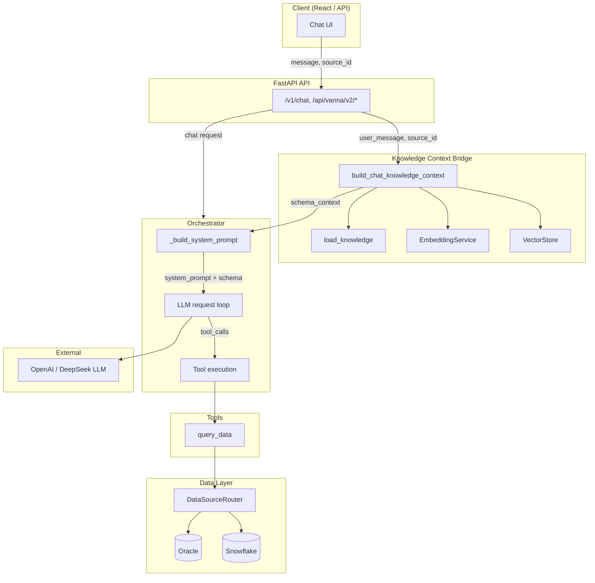
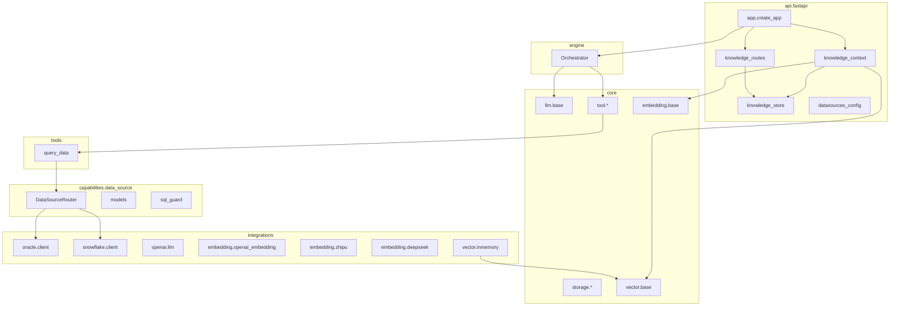

# Mine Agent Architecture Diagram

High-level architecture of the mine agent project, aligned with ADR-0001 and current implementation.

---

## 1. Layer Overview

```
┌─────────────────────────────────────────────────────────────────────────────┐
│                              API Layer (FastAPI)                             │
│  /v1/chat │ /api/vanna/v2/chat_poll │ chat_sse │ /v1/metadata │ /v1/knowledge │
└─────────────────────────────────────────────────────────────────────────────┘
                                        │
                                        ▼
┌─────────────────────────────────────────────────────────────────────────────┐
│                           Engine (Orchestrator)                              │
│  Chat loop │ Tool dispatch │ System prompt + Schema context injection        │
└─────────────────────────────────────────────────────────────────────────────┘
                                        │
              ┌─────────────────────────┼─────────────────────────┐
              ▼                         ▼                         ▼
┌─────────────────────┐   ┌─────────────────────┐   ┌─────────────────────┐
│   Core Abstractions │   │   Capabilities       │   │   Tools              │
│ LlmService, Tool,   │   │ DataSource, Router  │   │ query_data           │
│ EmbeddingService,   │   │ SQL Guard            │   │                      │
│ VectorStore         │   │                      │   │                      │
└─────────────────────┘   └─────────────────────┘   └─────────────────────┘
              │                         │                         │
              ▼                         ▼                         ▼
┌─────────────────────────────────────────────────────────────────────────────┐
│                         Integrations (Concrete)                              │
│  Oracle │ Snowflake │ OpenAI/DeepSeek LLM │ ZhiPu/OpenAI/DeepSeek Embedding  │
│  InMemoryVectorStore │ InMemoryConversationStore                             │
└─────────────────────────────────────────────────────────────────────────────┘
```

---

## 2. Chat + NL2SQL Data Flow



---

## 3. Knowledge Workflow (Schema-Aware NL2SQL)

```mermaid
flowchart LR
    subgraph Config["1. Connection Config"]
        ConnUI[Connections UI]
        DynJSON[(~/.mine/dynamic_datasources.json)]
        Env[MINE_DATASOURCES]
        ConnUI --> DynJSON
    end

    subgraph Schema["2. Schema Extraction"]
        Extract[Schema Extract]
        Enrich[Async Enrich<br/>LLM: join_paths, er_graph]
    end

    subgraph Knowledge["3. Knowledge Store"]
        ErEditor[ER Editor / JSON Editor]
        SaveKN[(~/.mine/knowledge/{source_id}.json)]
    end

    subgraph Vector["4. Vectorization"]
        Chunk[Chunk knowledge]
        Embed[Embedding API]
        VecStore[(VectorStore<br/>knowledge:{source_id})]
        Chunk --> Embed --> VecStore
    end

    subgraph Chat["5. Chat + NL2SQL"]
        ChatUI[Chat UI]
        Retrieve[Retrieve schema by question]
        GenSQL[LLM generates SQL]
        ExecSQL[Execute via DataSourceRouter]
    end

    ConnUI --> Extract
    Extract --> Enrich
    Enrich --> ErEditor
    ErEditor --> SaveKN
    SaveKN --> Chunk
    Env --> Router[DataSourceRouter]
    DynJSON --> Router
    ChatUI --> Retrieve
    VecStore --> Retrieve
    Retrieve --> GenSQL
    GenSQL --> ExecSQL
    Router --> ExecSQL
```

---

## 4. Module Dependency (Simplified)



---

## 5. Component Summary

| Layer | Components | Responsibility |
|-------|------------|----------------|
| **API** | `app.py`, `knowledge_routes`, `datasources_config` | HTTP endpoints, auth, CORS, error mapping |
| **Engine** | `Orchestrator` | Chat loop, tool orchestration, system prompt + schema context |
| **Core** | `LlmService`, `Tool`, `EmbeddingService`, `VectorStore` | Abstractions for LLM, tools, embeddings, vector search |
| **Capabilities** | `DataSourceRouter`, `DataSource`, `sql_guard` | Data source routing, SQL validation |
| **Integrations** | Oracle, Snowflake, OpenAI, ZhiPu, DeepSeek, InMemoryVectorStore | Concrete implementations |
| **Tools** | `QueryDataTool` | Execute SQL against registered data sources |
| **Knowledge** | `knowledge_context`, `knowledge_store`, vectorize | Schema-aware NL2SQL via RAG |

---

## 6. Key Endpoints

| Method | Path | Purpose |
|--------|------|---------|
| GET | `/v1/health` | Health check |
| GET | `/v1/metadata` | Service info, registered data sources |
| POST | `/v1/chat` | Main chat endpoint |
| POST | `/api/vanna/v2/chat_poll` | Legacy poll chat |
| POST | `/api/vanna/v2/chat_sse` | Legacy SSE chat |
| GET | `/v1/datasources/config` | List connections |
| POST | `/v1/datasources/config` | Create connection |
| POST | `/v1/knowledge/schema/extract` | Extract schema |
| POST | `/v1/knowledge/schema/enrich/async` | Async enrich (join paths, ER) |
| GET/PUT | `/v1/knowledge/{source_id}` | Knowledge CRUD |
| POST | `/v1/knowledge/{source_id}/vectorize` | Vectorize knowledge |
| GET | `/v1/knowledge/embedding-options` | Available embedding models |
| GET | `/v1/knowledge/{source_id}/embedding-config` | Locked embedding config |
